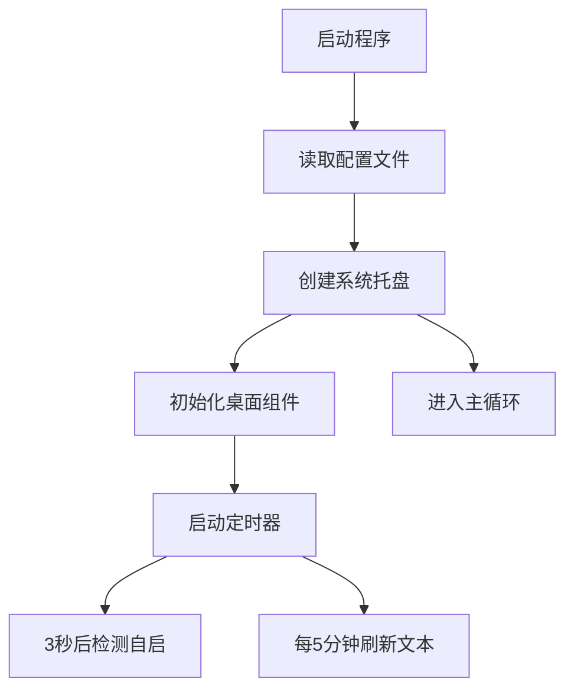

# Quick Tray

      

  

 [特点](#特点) | [下载](#下载) | [声明](#声明) | [LICENSE](LICENSE)

基于 PySide6 的系统托盘工具应用，主要提供快速启动、文本展示和系统管理功能

<!--  -->

# 特点
**系统托盘功能**
- **托盘图标**：
  - 显示自定义图标（从配置文件中读取）
  - 悬停提示显示程序名、版本号、菜单项数量和自启状态
- **右键菜单**：
  - 多级分类菜单（应用/链接/脚本等）
  - 设置管理（编辑菜单/修改配置）
  - 文本操作（更新/复制/编辑）
  - 搜索功能（调用浏览器搜索）
  - 关于信息（GitHub/检查更新）

---

**桌面组件**
- **随机文本标签**：
  - 桌面置顶透明窗口
  - 从 `lines.json` 随机显示文本
  - 支持手动更新/复制文本内容
- **搜索框**：
  - 圆角透明输入框
  - 回车后使用必应搜索内容
  - 通过托盘菜单呼出

---

**核心功能**
- **快捷启动**：
  - 解析 `applist.json` 配置文件
  - 支持启动本地程序/脚本/网页链接
  - 分类管理（收藏/应用/链接/脚本）
- **自启管理**：
  - 检测电源状态（仅充电时触发）
  - 自动启动标记为 "star" 的程序
- **版本检测**：
  - 检查 GitHub 版本更新
  - 通过托盘消息通知结果
- **单例运行**：
  - 通过端口占用检测防止多开
- **剪贴板集成**：
  - 一键复制文本标签内容

---

**配置文件管理**
| 文件                | 功能说明                       |
| ------------------- | ------------------------------ |
| `basic_config.json` | 程序基本设置（图标/端口/自启） |
| `applist.json`      | 菜单项配置（名称/路径/类型）   |
| `lines.json`        | 文本标签的随机语录库           |

---
**设计**
- **透明界面**：
  - 所有窗口支持透明度和鼠标穿透
  - 圆角设计 + 置顶显示
- **资源控制**：
  - QTimer 实现定时任务（文本刷新/自启检测）
  - 电源状态检测（psutil）
- **错误处理**：
  - 启动项路径有效性验证
  - 网络请求异常捕获

---

 **程序流程**

> **注**：程序无主窗口，完全通过托盘图标交互，适合后台轻量级使用。核心是实用的快速启动工具。
> 
> 在**ver1.11.2-25718**版本后添加了一个简单的窗口。

# 下载

https://github.com/Pfolg/QuickTray/releases

或者

克隆此仓库到本地使用源码运行

# 声明

感谢所有本程序涉及的第三方库及Python语言开发者们，未能一一致谢，抱歉！

如果程序中涉及的一些材料侵犯了您的版权，请联系我删除！
