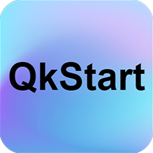
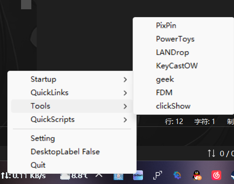

  <h2>QKStart</h3>

  
  
  
  
  
  
  
  

 

# QkStart

**快捷方式的替代：快捷托盘**

如果你不喜欢桌面上放着一堆杂乱的快捷方式，又不想整理。但是呢，平时又有不得不用的工具。鱼逝，我就用Python写了一个这样的工具，目的是为了解放桌面（其实还是练习Python）。

程序很简单，目前是第6版本。

[Download](https://github.com/Pfolg/QkStart/releases/tag/v6)

# Function

设置基于Config.json！还有Windows11，也就是说，不能保证这个程序可以在其他操作系统上运行！

使用 Python 3.11.9 开发

程序读取 config.json 文件后，然后在托盘创建一个图标，图标里面包含有快捷（链接），每一个链接有相应的功能（需要用户自己设置）。

放在 Startup 区域里面的链接，可以在开机启动一分钟后启动（如果连接了电源）。

用户可以自定义托盘图标logo，还可以自定义启动（Startup）提示音，这里作者给大家带来了一份的马超音效。

# Set

## 环境配置（源码运行）

1、先克隆此仓库到本地

2、配置Python依赖，最好先创建一个虚拟环境再安装依赖：

~~~shell
pip install -r requirements.txt 
~~~

3、运行 `startup.pyw` 或 `setting.pyw`

## 粗糙的教程

**[教程视频](https://www.bilibili.com/video/BV1BbkoYBEbB/)**

+ 1、点击 setting 程序进行设置
+ 2、直接修改 config.json 文件进行设置（推荐）
+ 3、通过导航程序（不知道点哪个先点这个）设置
+ 4、如果没有插件的话，可以自己新建 plugins 文件夹，然后放一些自己写的程序或者脚本在里面，这个仓库里面有几个Python脚本，但可能不是你喜欢的，如果你想用的话，自己下载

# Issues

+ 1、由于设置程序没有办法进行开机自启动的设置，需要通过导航程序来设置。**导航程序的设置在后续测试中表现不佳，请使用`start up`文件夹进行自启动的设置。**
+ 2、插件指的是一些小程序，可有可无，插件的来源可以是你自己写的，也可以是别人写的。如要添加插件，请把插件放到 plugins 文件夹（如果没有，则需要创建）内，然后运行更新插件程序（在导航程序内）
+ 3、现有的分类可能不会满足您的使用需求，您可以自行更改（配置文件和相应代码）
+ 4、setting 程序设置完后，会有两秒的迟疑，这是因为程序需要花两秒钟的时间来等待设置线程保存您的设置
+ 5、如果需要源码运行，可以直接克隆仓库，然后安装依赖
+ 6、程序可以开启多个实例（我不太会锁一个实例），为了您的电脑健康，请尽量少开实例
+ 7、由于开发者是初学 Python，难免会有些错误，请反馈至issue

# 声明

感谢所有本程序涉及的第三方库及Python语言开发者们，未能一一致谢，抱歉！

如果程序中涉及的一些材料侵犯了您的版权，请联系我删除！