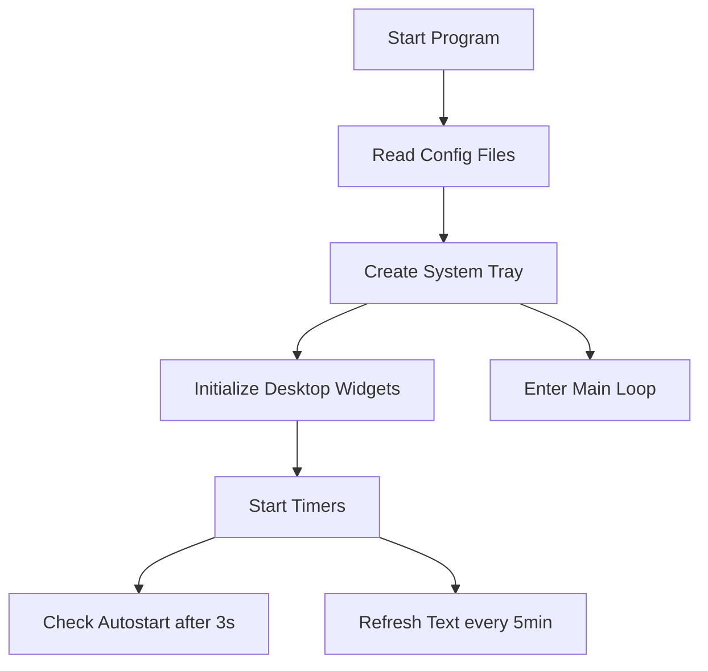

# Quick Tray

      

   

|[Features](#features) | [Download](#download) | [Declaration](#declaration) | [LICENSE](LICENSE)|[简体中文](docs/README.zh.md)|
|:--:|:--:|:--:|:--:|:--:|

_A system tray utility based on PySide6, providing quick launch and text display functions._

# Features

+ System tray functionality
+ Desktop widgets
+ Quick launch
+ Autostart management

---

**Program Workflow**

>[!NOTE]
> The program has no main window and operates entirely through the system tray icon, suitable for lightweight background use. Core functionality is quick application launching.
>
> A simple window was added starting from **ver1.11.2-25718**.

# Download

>[!WARNING]
> Not compatible with versions prior to v1.11

| Windows | [releases](https://github.com/Pfolg/QuickTray/releases) |
|:-------:|:-------------------------------------------------------:|

Alternatively:

Clone this repository and run the source code from `src`

**Configuration File Management**
| File | Description |
| ------------------- | ------------------------------ |
| `basic_config.json` | Basic settings (icons/port/autostart) |
| `applist.json`      | Menu items configuration (name/path/type) |
| `lines.json`        | Random quotes database for text labels |

# Declaration

This program absolutely never collects user information. Source code is open for inspection.

If you encounter any issues during use, please don't hesitate to file an Issue. Developers with unique ideas are welcome to submit pull requests!

Gratitude to all third-party libraries involved and Python language developers. Apologies for not acknowledging everyone individually! <!-- Will be optimized in future updates -->

If any materials used in this program infringe your copyright, please contact me for removal!
